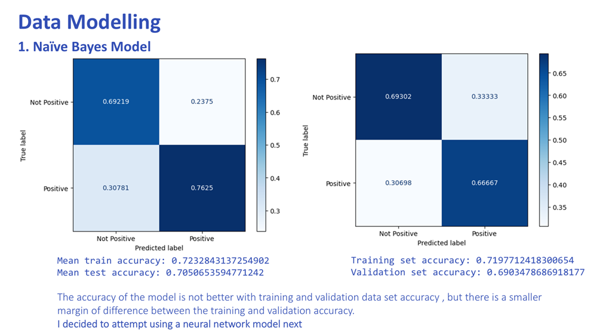
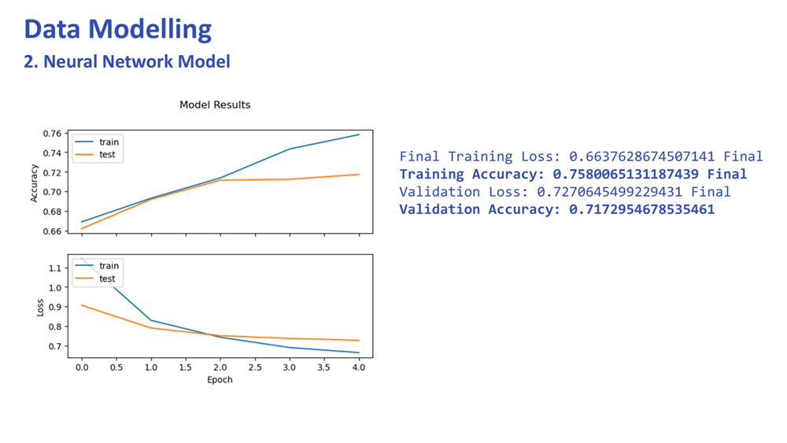

# TweetSentimentAnalysis
Model to analyse tweet sentiments from datasets

# Introduction
Companies rely on social media to understand how customers feel about their brands and products. However, it’s not always easy to tell whether a tweet expresses a clear opinion or which brand the sentiment is directed at, especially when multiple brands are mentioned.

This project will develop a sentiment analysis model that can:

- Classify tweets as positive, negative, or neutral.
- Correctly link emotions to the right brand or product.
- Track sentiment trends over time to spot issues or opportunities early.

With better sentiment tracking, businesses can fine-tune their marketing, improve customer engagement, and respond faster to brand perception shifts.

### Data Overview
In this project, I will analyze a dataset from CrowdFlower (https://data.world/crowdflower/brands-and-product-emotions/) on the data.world website. The dataset contains over 9000 tweets with sentiments on apple and google products. These sentiments can be classified into positive, neutral and negative sentiments and a quick scan of the data shows they were collected during the SXSW (South by South West) concert seemingly in 2013.

# Approach
### My Thinking
I decided on an approach that would categorize the data into positive and non positive tweets, which would allow a binary approach further considering that positive sentiments would be the ones to most likely be used to drive sales up, and non positive sentiments be studied to establish where to improve products.

### Accuracy:
I also endevoured to achieve as accurate a model as possible as it would allow me to avoid any false positive/negative results that would affect a users ability to utilize the output of the model.

### Modelling
I used nltk's TweetTokenizer and RegexpTokenizer to tokenize the tweets. and further used vectorizer and tfidf vectorizer to vectorize them. 

Techniques used:

- Naïve Bayes for baseline performance,
- Neural Networks to capture complex patterns in sentiment.

Which allowed me to test simple to complex approaches

# Results

Comparison:

Naïve Bayes Results:
Training set accuracy: 0.72 or 72%
Validation set accuracy: 0.69 or 69%
------------------------------------------
Neural Network Results:
Final Training Accuracy: 0.76 or 76%
Final Validation Accuracy: 0.72 or 72%

The Neural Network outperforms Naive Bayes, showing better performance on both training and validation sets.
However, the validation accuracy is still lower than training accuracy, suggesting some overfitting.

# Recommendations & Conclusion

I therefore recommend going ahead with the Neural Network (instead of Naive Bayes) for twitter sentiment analysis. It does a better job overall of linking a sentiment to a Brand (in this case positive and negative emotion towards Apple and Google Products)
- Any data scientist using it will need to further hyperparameter tune for more optimal results
- The model will also require mor datasets for training and I suggest that the two organizations - Apple and Google - may assist in providing additional data.

How the Neural Network Model can be used by Apple and Google Tech companies:

- Brand Monitoring: Track the sentiment of tweets about Apple and Google products in real-time. This will help them monitor how their products are perceived and they can address any issues more efficiently.

- Customer Feedback Analysis: Automatically classify customer feedback (positive and non positive sentiments) to identify areas where products are performing well and where improvements are needed.

- Marketing Strategy: Use the sentiment analysis to refine marketing campaigns. Positive sentiments can be used to guid promotional efforts, while negative sentiments can be used to improve campaigns.

- Trend Analysis: Analyze sentiment trends over time to detect shifts in consumer perception so they can anticipate a crisis before it happens

